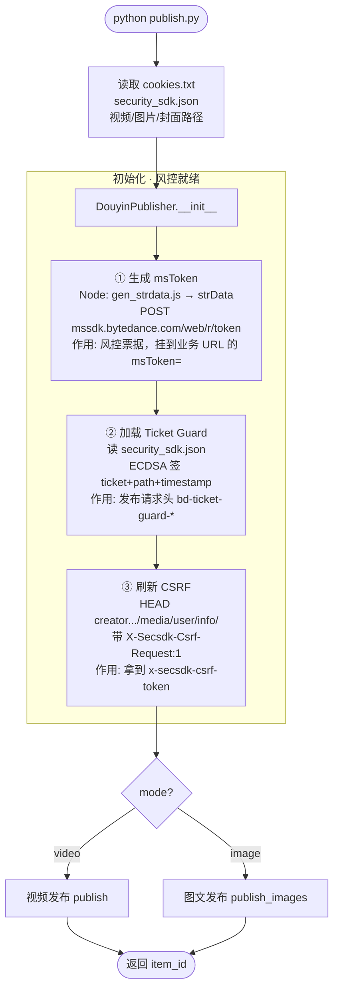
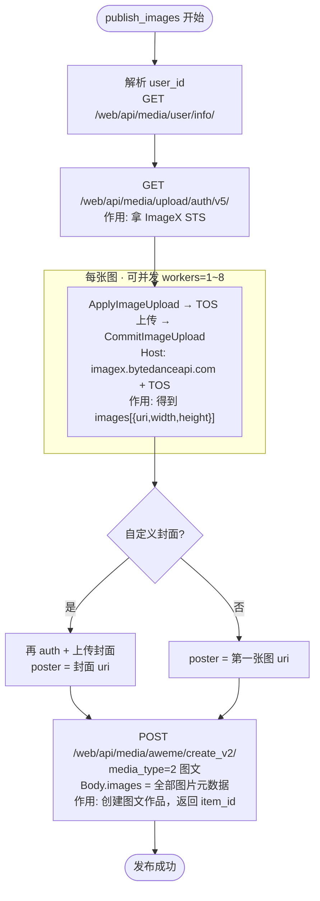
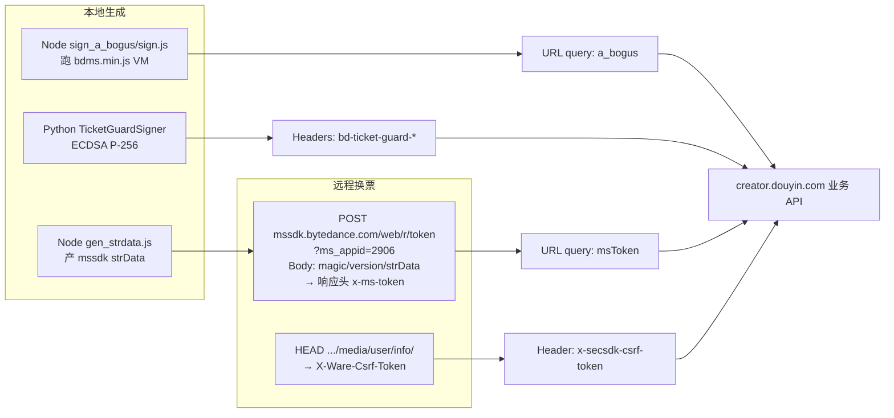
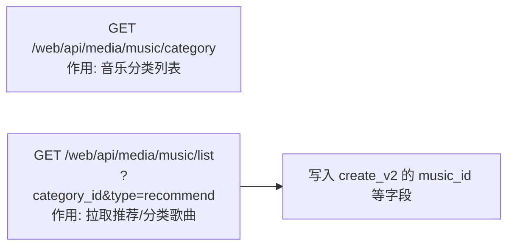

# 抖音创作者中心 · 纯 HTTP 发布流程图

基于 `publish.py` + `sign_params.py`，标注各接口及作用。

---

## 1. 总览：初始化 → 分支发布

---

## 2. 视频发布主流程（接口逐步标注）

```mermaid
flowchart TD
    A([publish 开始]) --> B

    B["STEP 0 · 解析 user_id<br/>GET /web/api/media/user/info/<br/>Host: creator.douyin.com<br/>作用: 从登录态取 uid，后续上传必填"]

    B --> C["STEP 1 · 获取上传凭证 STS<br/>GET /web/api/media/upload/auth/v5/<br/>Host: creator.douyin.com<br/>作用: 换临时 AccessKey / Secret / SessionToken<br/>用于签 VOD / ImageX 请求"]

    C --> D["STEP 2 · 申请视频上传地址<br/>GET vod.bytedanceapi.com<br/>?Action=ApplyUploadInner<br/>&SpaceName=aweme&FileType=video<br/>签名: AWS4-HMAC-SHA256 service=vod<br/>作用: 拿到 Vid、StoreUri、UploadHost、<br/>SessionKey、分片 Auth"]

    D --> E

    subgraph TOS["STEP 3 · TOS 分片上传视频"]
        E["POST https://{UploadHost}/upload/v1/{StoreUri}<br/>?uploadmode=part&phase=init<br/>作用: 初始化分片，返回 uploadid"]
        E --> F["POST ...?phase=transfer&part_number=N<br/>Body: 5MB 分片 + Content-CRC32<br/>作用: 逐片上传视频二进制"]
        F --> G["POST ...?phase=finish&uploadid=...<br/>Body: 1:crc,2:crc,...<br/>作用: 合并分片，完成对象存储写入"]
    end

    G --> H["STEP 4 · 提交视频入库<br/>POST vod.bytedanceapi.com<br/>?Action=CommitUploadInner<br/>Body: SessionKey + GetMeta/Snapshot<br/>作用: 确认上传完成，返回正式 video_id(Vid)<br/>并触发元数据/封面截帧"]

    H --> I["STEP 5 · 再取一次 STS<br/>GET /web/api/media/upload/auth/v5/<br/>作用: 封面走 ImageX，重新拿临时凭证"]

    I --> J

    subgraph Cover["STEP 6-7 · 上传封面 JPEG"]
        J["GET imagex.bytedanceapi.com<br/>?Action=ApplyImageUpload<br/>&ServiceId=jm8ajry58r<br/>作用: 申请封面上传节点 StoreUri/Auth"]
        J --> K["POST https://{host}/upload/v1/{StoreUri}<br/>作用: 上传封面 JPEG 到对象存储"]
        K --> L["POST imagex.bytedanceapi.com<br/>?Action=CommitImageUpload<br/>作用: 提交图片，返回 poster uri + 宽高"]
    end

    L --> M

    subgraph Ready["STEP 7.5 · 等待转码就绪（轮询）"]
        M["GET /web/api/media/video/enable/<br/>?video_id=...<br/>作用: 查询视频是否已启用/可发布"]
        M --> N["GET /web/api/media/video/transend/<br/>?video_id=...<br/>作用: 查询转码进度 encode/codec/bitrate<br/>二者都 OK 才继续，否则 sleep 2s 重试"]
    end

    N --> O["STEP 8 · 正式发布<br/>POST /web/api/media/aweme/create_v2/<br/>media_type=4 视频<br/>Query: msToken + a_bogus + 浏览器指纹参数<br/>Header: CSRF + bd-ticket-guard-*<br/>Body: title/caption/话题/可见性/<br/>video_id/poster/creation_id 等<br/>作用: 创建作品，成功返回 item_id"]

    O --> Z([发布成功])
```

---

## 3. 图文发布流程

---

## 4. 创作者业务请求的风控挂载（每次 `_creator_url`）

| 参数 | 来源 | 挂载位置 | 作用 |
|------|------|----------|------|
| `msToken` | Node `strData` → `POST /web/r/token`，之后从响应头续用 | URL query | 设备/会话风控票据 |
| `a_bogus` | Node 跑 `bdms.min.js` | URL query | 请求签名（method+url+body+指纹） |
| `bd-ticket-guard-*` | `security_sdk.json` ECDSA | 请求头 | 证明持有账号侧 EC 私钥 |
| `x-secsdk-csrf-token` | HEAD `user/info` | 请求头 | 防 CSRF，发布前会再刷一次 |

---

## 5. 可选：配乐相关接口

---

## 接口速查表

| 步骤 | 方法 | 接口 | 作用 |
|------|------|------|------|
| 风控 | POST | `mssdk.bytedance.com/web/r/token` | 用 strData 换 `msToken` |
| 风控 | HEAD | `creator.../web/api/media/user/info/` | 取 CSRF |
| 鉴权 | GET | `.../media/user/info/` | 解析 `user_id` |
| 上传凭证 | GET | `.../media/upload/auth/v5/` | 临时 STS（AK/SK/Token） |
| 视频申请 | GET | `vod.bytedanceapi.com?Action=ApplyUploadInner` | 申请上传节点 |
| 视频上传 | POST | `{UploadHost}/upload/v1/{StoreUri}` | init / transfer / finish 分片 |
| 视频提交 | POST | `vod...?Action=CommitUploadInner` | 得到正式 `video_id` |
| 封面/图 | GET | `imagex...?Action=ApplyImageUpload` | 申请图片上传 |
| 封面/图 | POST | TOS `upload/v1/...` + `CommitImageUpload` | 上传并得到 `uri` |
| 转码轮询 | GET | `.../media/video/enable/` | 视频是否可启用 |
| 转码轮询 | GET | `.../media/video/transend/` | 转码是否完成 |
| **发布** | **POST** | **`.../media/aweme/create_v2/`** | **创建作品（视频 type=4 / 图文 type=2）** |
| 配乐 | GET | `.../media/music/category` · `.../list` | 选歌（可选） |

---

## 路径摘要

- **视频**：STS → VOD 申请/分片/提交 → ImageX 封面 → 等转码 → `create_v2`（`media_type=4`）
- **图文**：STS → 多图 ImageX → `create_v2`（`media_type=2`）
